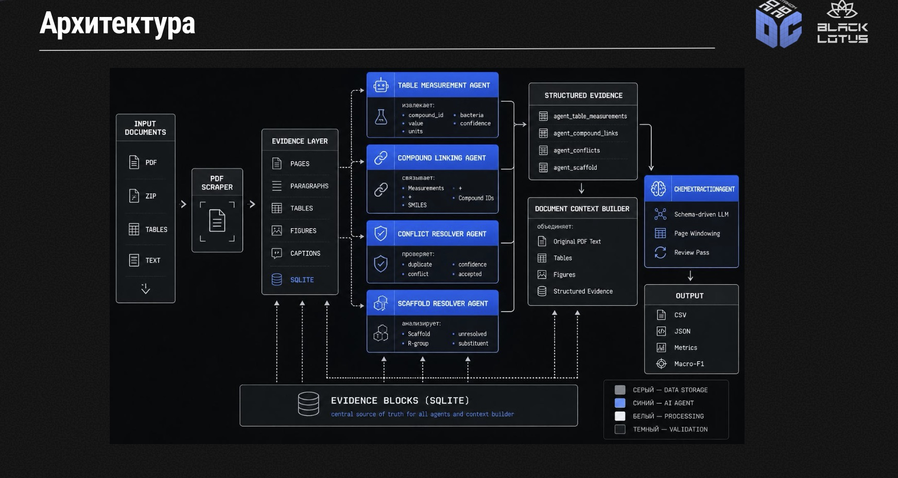

# DataCon'26 ChemX Extractor

Финальная версия проекта для задачи DataCon'26 ChemX: web-сервис и CLI-пайплайн
для извлечения химических записей из научных PDF, ZIP-архивов, таблиц и
текстовых файлов с последующей оценкой качества по ChemX-compatible Macro-F1.

Проект завершен как end-to-end решение: есть FastAPI-интерфейс, JSON API,
real-time мониторинг запусков, SQLite evidence layer, LLM extractor,
evaluator-compatible CLI, Docker-деплой и тесты.

## Возможности

- Загрузка `PDF`, `ZIP` с PDF, `CSV`, `TSV`, `TXT` и `MD`.
- Real-time pipeline через Server-Sent Events:
  `ingest -> preprocess -> vision -> extract -> score`.
- Поддержка 10 ChemX-доменов:
  `EyeDrops`, `Benzimidazoles`, `Oxazolidinones`, `Co-crystals`, `Complexes`,
  `Nanozymes`, `Synergy`, `Nanomag`, `Cytotox`, `SelTox`.
- Полный PDF-контур для поддержанных доменов:
  scraper -> SQLite evidence -> visual/structure evidence -> structured agents
  -> schema-driven LLM extraction -> optional review pass.
- Fallback без LLM: локальная эвристическая экстракция из таблиц, selectable
  PDF text, TXT/MD и ZIP summary.
- Экспорт результатов job в `CSV` и `JSON`.
- Dashboard метрик с Macro-F1 и сравнением с опубликованными baseline.
- CLI `datacon_agent` для batch extraction, review, download и evaluation.
- Docker Compose деплой с optional HTTPS через Caddy.

## Архитектура



Подробная схема лежит в [`docs/system_architecture.md`](docs/system_architecture.md).

## Структура проекта

```text
app/                         FastAPI web UI, API, job service, templates, static
app/services/scraper/        PDF -> SQLite evidence scraper, visual queue, OCSR
app/services/agent/          checker и chemical image agents
datacon_agent/               production ChemX extractor, CLI, metrics, schemas
docs/                        архитектура, scraper, agents, bench runs
tests/                       pytest coverage для API, CLI-схем, metrics и agents
uploads/                     сохраненные входные файлы, ignored
runs/                        отчеты и артефакты запусков, ignored
outputs/                     локальные CSV/metrics outputs, ignored
```

## Быстрый старт

```bash
python3 -m venv .venv
source .venv/bin/activate
pip install -r requirements.txt
uvicorn app.main:app --reload
```

Откройте:

```text
http://127.0.0.1:8000
```

Полезные страницы:

- `http://127.0.0.1:8000/` - загрузка файла и запуск extraction.
- `http://127.0.0.1:8000/realtime` - live pipeline.
- `http://127.0.0.1:8000/metrics` - ChemX metrics dashboard.
- `http://127.0.0.1:8000/api/docs` - Swagger UI.

Health check:

```bash
curl http://127.0.0.1:8000/api/health
```

## Настройка LLM

В web-интерфейсе router URL, API key, model, review model и window-настройки
передаются для конкретного запуска. API key не возвращается в `/api/jobs`, SSE
и exports; наружу попадает только флаг `api_key_configured`.

Для CLI/offline сценариев можно создать `.env`:

```bash
cp .env.example .env
```

Пример OpenAI-compatible настроек:

```text
OPENAI_API_KEY=sk-...
OPENAI_BASE_URL=https://api.openai.com/v1
OPENAI_MODEL=gpt-4.1
OPENAI_REVIEW_MODEL=gpt-4.1
```

В CLI тот же endpoint можно передать явно через `--base-url`.

Для VseGPT-совместимого старого checker-контура поддерживаются:

```text
VSEGPT_API_KEY=sk-...
VSEGPT_BASE_URL=https://api.vsegpt.ru/v1
VSEGPT_MODEL=openai/gpt-4o-mini
```

## CLI

Список доменов:

```bash
python -m datacon_agent.cli domains
```

Схема structured output для домена:

```bash
python -m datacon_agent.cli schema --domain nanozymes
```

Скачать open-access PDF по ChemX-домену:

```bash
python -m datacon_agent.cli download-pdfs \
  --domain nanozymes \
  --out-dir data/pdfs/nanozymes \
  --limit 20 \
  --mailto you@example.com
```

Один PDF:

```bash
python -m datacon_agent.cli extract \
  --domain benzimidazole \
  --pdf data/pdfs/article.pdf \
  --out outputs/article.csv \
  --model gpt-4.1 \
  --pages-per-window 4
```

Batch по директории PDF:

```bash
python -m datacon_agent.cli batch \
  --domain nanozymes \
  --pdf-dir data/pdfs/nanozymes \
  --out outputs/nanozymes_candidates.csv \
  --model gpt-4.1 \
  --review-model gpt-4.1 \
  --pages-per-window 5 \
  --max-image-pages-per-window 3 \
  --review-context-chars 60000
```

Review pass по уже созданному CSV:

```bash
python -m datacon_agent.cli review-csv \
  --domain nanozymes \
  --pred outputs/nanozymes_candidates.csv \
  --pdf-dir data/pdfs/nanozymes \
  --out outputs/nanozymes_reviewed.csv \
  --passes 2
```

Evaluation:

```bash
python -m datacon_agent.cli evaluate \
  --domain nanozymes \
  --pred outputs/nanozymes_reviewed.csv \
  --articles outputs/nanozymes_articles.txt \
  --out outputs/nanozymes_metrics.csv
```

## Scraper и evidence layer

Отдельный scraper сохраняет PDF-разбор в SQLite: страницы, evidence-блоки,
caption'ы, таблицы, строки таблиц, figures, visual tasks и FTS5-индекс.

```bash
python -m app.services.scraper pdf-dataset/antibiotics-12-01220-v2.pdf \
  --out runs/scrape-antibiotics \
  --doc-id antibiotics_1220
```

Основные артефакты:

```text
runs/scrape-antibiotics/scrape.sqlite
runs/scrape-antibiotics/tables/*.csv
runs/scrape-antibiotics/images/figures/*.png
runs/scrape-antibiotics/visual_tasks.csv
```

Запуск CLI через scraper-first режим:

```bash
python -m datacon_agent.cli extract \
  --domain benzimidazole \
  --pdf data/pdfs/article.pdf \
  --out outputs/article.csv \
  --use-scraper \
  --run-visual \
  --run-evidence-agents
```

Для уже готового `scrape.sqlite`:

```bash
python -m datacon_agent.cli extract \
  --domain benzimidazole \
  --pdf data/pdfs/article.pdf \
  --scrape-sqlite runs/article/scrape.sqlite \
  --out outputs/article.csv
```

Опциональный OCSR/DECIMER контур требует `requirements-visual.txt` и отдельного
окружения:

```bash
python -m app.services.scraper.visual_executor \
  runs/scrape-antibiotics/scrape.sqlite \
  --provider heuristic

python -m app.services.scraper.ocsr_executor \
  runs/scrape-antibiotics/scrape.sqlite \
  --provider molscribe \
  --device cpu \
  --min-confidence 0.5
```

## API

| Endpoint | Назначение |
| --- | --- |
| `GET /api/health` | readiness check |
| `GET /api/domains` | список ChemX-доменов |
| `GET /api/metrics` | агрегированные Macro-F1 метрики |
| `GET /api/jobs` | список запусков |
| `POST /api/upload` | загрузка файла и создание job |
| `POST /api/demo-job` | demo job без файла |
| `GET /api/jobs/{job_id}` | состояние job |
| `GET /api/jobs/{job_id}/events` | SSE stream |
| `POST /api/jobs/{job_id}/cancel` | отмена активной job |
| `GET /api/jobs/{job_id}/export.csv` | экспорт CSV |
| `GET /api/jobs/{job_id}/export.json` | экспорт JSON |

Ограничения upload из web/API:

- максимальный размер файла: `50 MB`;
- ZIP: до `12` PDF и до `120 MB` распакованного размера;
- разрешенные расширения: `.pdf`, `.csv`, `.tsv`, `.zip`, `.txt`, `.md`.

## Docker

Локальная сборка:

```bash
docker compose build
docker compose up -d
curl http://127.0.0.1:8000/api/health
```

Другой внешний порт:

```bash
APP_PORT=8080 docker compose up -d
```

Минимальный деплой на сервер:

```bash
git clone <repo-url> DATACON_2026
cd DATACON_2026
mkdir -p uploads runs
docker compose up -d --build
docker compose logs -f datacon-web
```

HTTPS через Caddy:

```text
SITE_ADDRESS=chemx.example.com
```

```bash
docker compose -f docker-compose.yml -f docker-compose.prod.yml up -d --build
```

Для легкого demo UI без тяжелого PDF/scraper/agent стека:

```bash
DOCKER_REQUIREMENTS=requirements-web.txt docker compose build
```

## Финальные результаты

Контрольный hackathon bench-run сохранен в
[`docs/hackathon_bench_run.md`](docs/hackathon_bench_run.md).

| Домен | PDF subset | Режим | Macro-F1 | Published baseline | Итог |
| --- | ---: | --- | ---: | ---: | --- |
| Benzimidazoles | 4 PDF | text, no review | `0.393453` | `0.217` | выше baseline |
| Synergy | 1 PDF | vision + review | `0.137931` | `0.080` | выше baseline |
| Co-crystals | 1 PDF | vision + review | `0.285714` | `0.296` | около baseline |

Дополнительные проверки:

- Nanozymes на 9 PDF: `0.615949` против `0.290701` у single-agent baseline на
  той же подвыборке.
- Nanozymes на 5 PDF после финальной нормализации: `0.625000` против
  `0.349333` у baseline.
- Benzimidazoles Mistral smoke с review-pass на одном PDF: `0.714286`.

## Тесты

```bash
source .venv/bin/activate
python -m pytest
```

Покрываются:

- приватность model config и API key;
- web/domain mapping и metrics payload;
- datacon schema, normalization и Macro-F1 evaluator;
- scraper context и импорт evidence;
- structured evidence agents;
- specialized chemical image agents.

## Документация

- [`docs/system_architecture.md`](docs/system_architecture.md) - полная схема системы.
- [`docs/scraper.md`](docs/scraper.md) - PDF scraper и SQLite evidence model.
- [`docs/agent_checker.md`](docs/agent_checker.md) - single-agent checker.
- [`docs/multi_agent_chemical_pipeline.md`](docs/multi_agent_chemical_pipeline.md) - image/chemical OCR agents.
- [`docs/chemx_domain_sweep.md`](docs/chemx_domain_sweep.md) - доступность доменов и PDF.
- [`docs/chemx_mistral_check.md`](docs/chemx_mistral_check.md) - Mistral проверка.
- [`docs/hackathon_bench_run.md`](docs/hackathon_bench_run.md) - финальный bench-run.

## Примечания

- `uploads/`, `runs/`, `outputs/`, `.env` и локальные датасеты не должны
  попадать в git.
- Для production-запуска рекомендуется полный `requirements.txt`; для web-demo
  без тяжелых зависимостей можно использовать `requirements-web.txt`.
- Если CLI запускается не из `.venv`, убедитесь, что установлен `PyMuPDF`
  (`fitz`), иначе команды `datacon_agent` не смогут импортировать PDF/downloader
  модуль.
