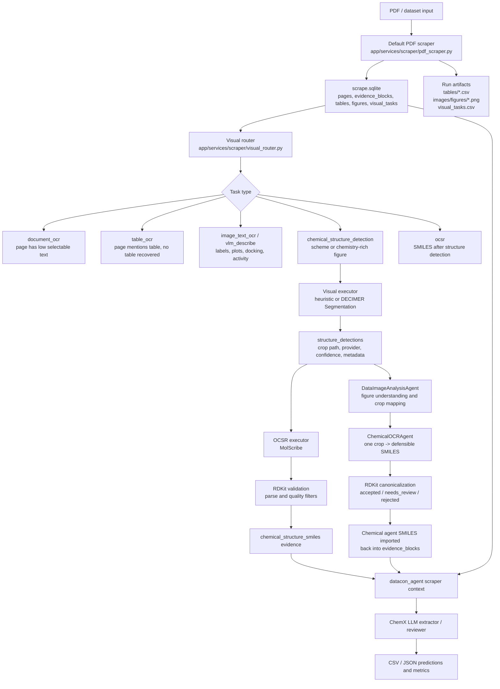
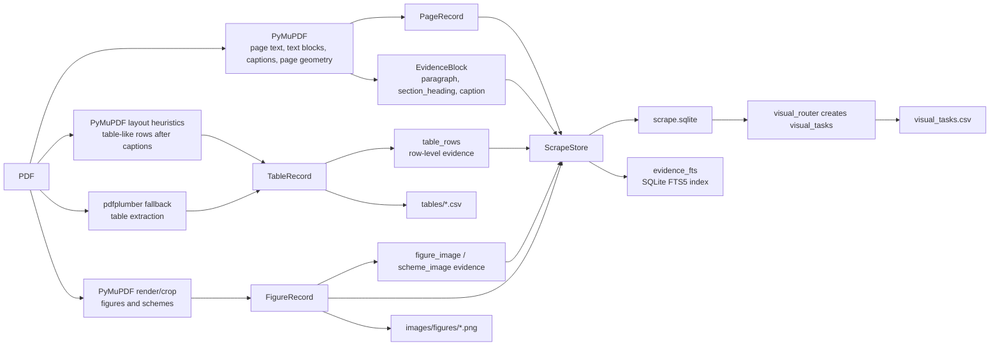
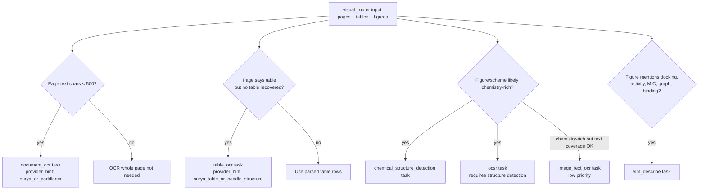
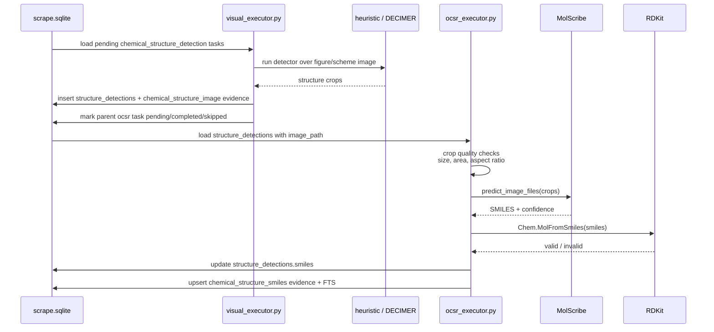
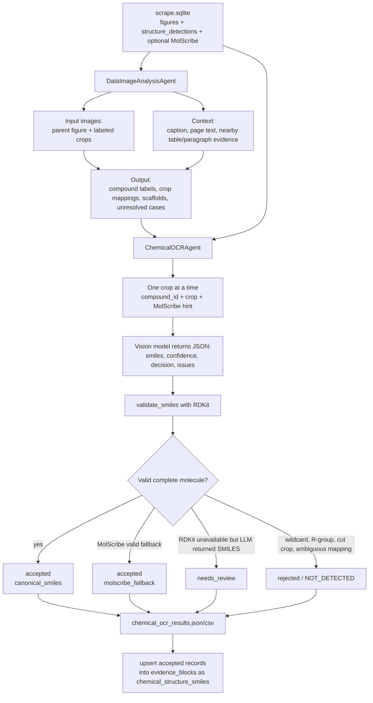
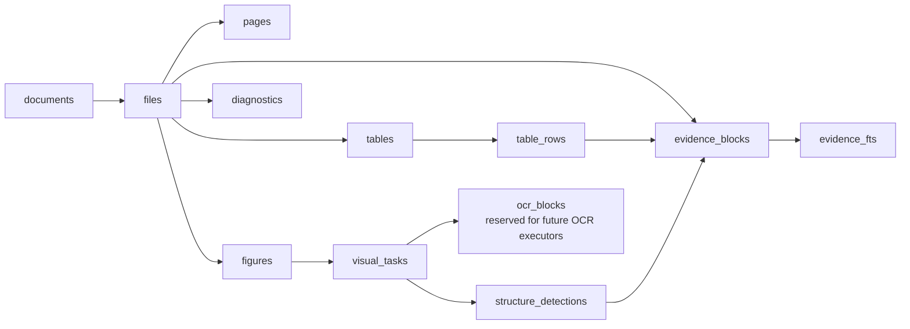

# Архитектура OCR, default scraper и chemical OCR

Документ для презентации по текущему решению DataCon'26 ChemX. Он описывает не
только "классический OCR", но и смежные стадии, которые в проекте разделены:

- **default scraper**: быстрый PDF-to-SQLite слой свидетельств;
- **OCR routing**: постановка задач на OCR страниц, таблиц и текста на картинках;
- **OCSR**: optical chemical structure recognition, то есть crop структуры -> SMILES;
- **chemical OCR agent**: vision-агентная проверка/достройка SMILES по crop и контексту;
- **downstream ChemX extractor**: LLM-экстракция записей по подготовленному evidence.

Важно: в текущем MVP обычный OCR страниц/таблиц **маршрутизируется как очередь
задач**, но отдельный executor для `document_ocr`, `table_ocr`,
`image_text_ocr` еще не реализован. Реально исполняемый визуальный контур сейчас:
structure detection -> MolScribe OCSR -> multi-agent chemical OCR -> RDKit
validation -> импорт SMILES обратно в `scrape.sqlite`.

## 1. Общая схема решения



Ключевая идея: финальный LLM не читает PDF как непрозрачный blob. Сначала
создается проверяемый слой `evidence`, где у каждого фрагмента есть страница,
тип источника, bbox, parser, confidence и ссылка на crop или таблицу.

## 2. Default scraper

### Назначение

Default scraper превращает PDF в локальную SQLite-базу с прослеживаемыми
свидетельствами. Это не финальная ChemX-экстракция, а слой подготовки данных для
поиска, RAG, проверки и дальнейших агентов.

### Схема default scraper



### Что извлекается

| Объект | Где хранится | Parser / источник | Для чего нужен |
| --- | --- | --- | --- |
| Страницы и selectable text | `pages` | PyMuPDF | Базовый текстовый контекст |
| Параграфы и заголовки | `evidence_blocks` | PyMuPDF text blocks | RAG/LLM evidence |
| Подписи таблиц/рисунков | `evidence_blocks` | regex over PyMuPDF blocks | Связь текста с таблицами/фигурами |
| Таблицы | `tables`, `table_rows`, CSV | PyMuPDF layout + pdfplumber | Измерения и ChemX-признаки |
| Рисунки/схемы | `figures`, `images/figures/*.png` | PyMuPDF render/crop | Вход для visual/chemical stages |
| Очередь OCR/OCSR/VLM | `visual_tasks`, `visual_tasks.csv` | visual_router heuristics | План тяжелых визуальных операций |
| Химические crop-кандидаты | `structure_detections` | heuristic / DECIMER | Вход для OCSR и chemical OCR |
| Распознанные SMILES | `structure_detections.smiles`, `evidence_blocks` | MolScribe / chemical OCR agent | Готовое chemical evidence |

## 3. OCR routing

В проекте OCR разделен на маршрутизацию и исполнение. Маршрутизация уже есть,
исполнители для обычного OCR пока оставлены как следующий этап.



### Текущий статус OCR-задач

| Task | Статус | Provider hint | Комментарий |
| --- | --- | --- | --- |
| `document_ocr` | очередь есть, executor не реализован | Surya / PaddleOCR | Нужен для сканов или страниц с малым selectable text |
| `table_ocr` | очередь есть, executor не реализован | Surya table / PaddleOCR PP-Structure | Нужен для сложных таблиц |
| `image_text_ocr` | очередь есть, executor не реализован | Surya / PaddleOCR | Нужен для labels внутри фигур |
| `vlm_describe` | очередь есть, executor не реализован | vision LLM | Нужен для графиков, docking, visual-only evidence |
| `chemical_structure_detection` | реализовано | heuristic / DECIMER | Находит crop-кандидаты структур |
| `ocsr` | реализовано | MolScribe | Конвертирует crop в SMILES |

## 4. Chemical structure detection и OCSR

### Схема visual executor + OCSR



### Providers

| Stage | Реализация | Что делает |
| --- | --- | --- |
| Structure detection: heuristic | `app/services/scraper/visual_executor.py` | Локально ищет connected components по темным/цветным пикселям, режет crop, пишет debug overlay |
| Structure detection: DECIMER | `decimer_segmentation.segment_chemical_structures_from_file` | Более сильный ML-сегментатор химических структур, рекомендован в отдельном env |
| OCSR | MolScribe | Преобразует crop структуры в SMILES |
| OCSR validation | RDKit | Проверяет, что SMILES парсится; canonicalization делает chemical OCR agent |
| Checkpoint loading | Hugging Face Hub | Загружает MolScribe checkpoint `yujieq/MolScribe` |

## 5. Multi-agent chemical OCR

Chemical OCR в проекте не равен MolScribe. MolScribe дает машинный кандидат
SMILES, а agent stage использует vision-модель для проверки crop и контекста.



### Два агента

| Агент | Файл | Вход | Выход | Ограничение |
| --- | --- | --- | --- | --- |
| `DataImageAnalysisAgent` | `app/services/agent/data_image_agent.py` | Parent figure, DECIMER/heuristic crops, caption, page text, nearby evidence, MolScribe hints | `compound_id -> crop_label`, scaffold warnings, unresolved cases | Не генерирует SMILES |
| `ChemicalOCRAgent` | `app/services/agent/chemical_ocr_agent.py` | Один crop, compound_id, mapping context, optional MolScribe candidate | SMILES candidate, confidence, issue codes, validation status | Не принимает R-group/scaffold/cut-off/ambiguous structures |

### Почему два агента, а не один

1. Первый агент решает задачу понимания фигуры: где подпись `6a`, какой crop ей
   соответствует, где scaffold, где reaction conditions.
2. Второй агент решает узкую задачу chemical OCR: один crop -> один защищаемый
   SMILES.
3. RDKit остается финальным синтаксическим фильтром: vision-модель не считается
   ground truth.

## 6. SQLite data model



Основной источник для downstream не папка с картинками, а таблица
`evidence_blocks`. Изображения нужны как проверяемые артефакты и как вход для
визуальных моделей.

### Evidence source types

| `source_type` | Значение |
| --- | --- |
| `paragraph` | Текстовый блок страницы |
| `section_heading` | Заголовок секции |
| `table_caption` | Подпись таблицы |
| `table_row` | Нормализованная строка таблицы |
| `figure_caption` | Подпись рисунка/схемы |
| `figure_image` | Evidence на crop обычного рисунка |
| `scheme_image` | Evidence на crop схемы |
| `chemical_structure_image` | Evidence на crop-кандидат химической структуры |
| `chemical_structure_smiles` | SMILES, полученный через MolScribe или chemical OCR agent |

## 7. Библиотеки и зависимости

### Core dependencies

| Библиотека | Где используется | Роль |
| --- | --- | --- |
| FastAPI | `app/main.py` | Web API и UI backend |
| Uvicorn | запуск web app | ASGI server |
| Jinja2 | `app/templates/*` | HTML templates |
| PyMuPDF / `fitz` | `pdf_scraper.py`, `datacon_agent/pdf.py` | PDF text, block layout, rendering pages/figures |
| pdfplumber | `pdf_scraper.py` | Fallback extraction таблиц |
| pypdf | `app/services/jobs.py` | Lightweight PDF selectable-text path для web MVP |
| Pillow | rendering/crop checks/heuristic detector | Работа с PNG/JPEG, crop validation |
| pandas | metrics, CSV workflows | Табличные данные |
| numpy | visual dependencies / metrics | Массивы и ML-зависимости |
| RDKit | OCSR validation, chemical OCR validation | SMILES parse/canonicalization |
| OpenAI-compatible Chat Completions | `app/services/agent/llm.py` | Vision LLM для DataImageAnalysisAgent и ChemicalOCRAgent |
| python-dotenv | CLI/web config | Загрузка `.env` |
| requests, tqdm, datasets | `datacon_agent` workflows | Download/evaluation utilities |
| SQLite / FTS5 | stdlib `sqlite3` | Evidence storage и полнотекстовый поиск |

### Optional visual/OCR/OCSR dependencies

| Библиотека | Статус | Роль |
| --- | --- | --- |
| DECIMER Segmentation | optional, отдельный Python 3.10 env | ML-сегментация химических структур |
| MolScribe | optional, OCSR env | Crop chemical structure -> SMILES |
| Hugging Face Hub | optional | Скачивание MolScribe checkpoint |
| PyTorch | transitive for MolScribe | Inference backend |
| OpenCV / `cv2` | optional import | Сохранение DECIMER array image, fallback на Pillow |
| Surya OCR | provider hint only | Планируемый OCR страниц/таблиц |
| PaddleOCR / PP-Structure | provider hint only | Планируемый OCR страниц/таблиц |

## 8. Пайплайн запуска

### Базовый scraper

```bash
python -m app.services.scraper pdf-dataset/antibiotics-12-01220-v2.pdf \
  --out runs/scrape-antibiotics \
  --doc-id antibiotics_1220
```

Результаты:

```text
runs/scrape-antibiotics/scrape.sqlite
runs/scrape-antibiotics/tables/*.csv
runs/scrape-antibiotics/images/figures/*.png
runs/scrape-antibiotics/visual_tasks.csv
```

### Structure detection

```bash
python -m app.services.scraper.visual_executor \
  runs/scrape-antibiotics/scrape.sqlite \
  --provider heuristic
```

Или optional DECIMER:

```bash
mamba run -n DECIMER_IMGSEG python -m app.services.scraper.visual_executor \
  runs/scrape-antibiotics/scrape.sqlite \
  --provider decimer
```

### OCSR через MolScribe

```bash
python -m app.services.scraper.ocsr_executor \
  runs/scrape-antibiotics/scrape.sqlite \
  --provider molscribe \
  --device cpu \
  --min-confidence 0.5
```

### Multi-agent chemical OCR

```bash
python -m app.services.agent.multi_agent_pipeline \
  runs/scrape-antibiotics/scrape.sqlite \
  --out runs/scrape-antibiotics/chemical_agents \
  --data-model openai/gpt-4o-mini \
  --chemical-model openai/gpt-4o-mini \
  --data-limit 1 \
  --chemical-limit 3 \
  --no-response-format
```

### Полный scraper-first запуск через `datacon_agent`

```bash
python -m datacon_agent.cli extract \
  --domain benzimidazole \
  --pdf data/pdfs/article.pdf \
  --out outputs/article.csv \
  --use-scraper \
  --run-visual --visual-provider decimer \
  --run-ocsr --ocsr-device cpu --ocsr-min-confidence 0.5 \
  --run-chemical-agents \
  --chemical-data-model openai/gpt-4o-mini \
  --chemical-model openai/gpt-4o-mini \
  --chemical-no-response-format
```

## 9. Artifacts для презентации

| Artifact | Где появляется | Что показывает |
| --- | --- | --- |
| `scrape.sqlite` | scraper run dir | Центральная evidence DB |
| `visual_tasks.csv` | scraper run dir | Какие OCR/OCSR/VLM задачи были поставлены |
| `tables/*.csv` | scraper run dir | Восстановленные таблицы |
| `images/figures/*.png` | scraper run dir | Parent figures/schemes |
| `images/structures/**/structure_*.png` | visual executor | Crop-кандидаты молекул |
| `images/structures/**/_detections.png` | heuristic detector | Debug overlay найденных областей |
| `chemical_ocr_results.json` | chemical agents dir | Полный отчет chemical OCR |
| `chemical_ocr_results.csv` | chemical agents dir | Табличный отчет по compound_id/crop/SMILES |
| `multi_agent_summary.json` | chemical agents dir | Сводка по двум агентам |
| `outputs/*.csv` | datacon_agent | Финальные ChemX-compatible predictions |

## 10. Что говорить на слайде

Короткая формулировка:

> Мы не пытаемся сразу извлечь ChemX-записи из PDF одним запросом. Сначала
> строим проверяемый evidence layer: текст, таблицы, подписи, crop'ы фигур,
> задачи OCR/OCSR и распознанные SMILES. Затем химический визуальный контур
> отдельно находит структуры, распознает SMILES, проверяет их RDKit и возвращает
> принятые результаты обратно в SQLite. Финальный LLM работает уже по
> структурированному, трассируемому контексту.

Разделение ответственности:

| Компонент | Ответственность |
| --- | --- |
| `pdf_scraper.py` | Дешево и воспроизводимо разобрать PDF в evidence |
| `visual_router.py` | Решить, где нужен тяжелый OCR/OCSR/VLM |
| `visual_executor.py` | Найти crop-кандидаты химических структур |
| `ocsr_executor.py` | Прогнать MolScribe и принять только валидные SMILES |
| `DataImageAnalysisAgent` | Понять фигуру и сопоставить labels с crop'ами |
| `ChemicalOCRAgent` | Проверить один crop и выдать защищаемый SMILES |
| `datacon_agent` | Использовать enriched evidence для финальной ChemX-экстракции и оценки |

## 11. Ограничения и следующие шаги

Текущие ограничения:

- OCR страниц/таблиц пока только маршрутизируется в `visual_tasks`; executor для
  Surya/PaddleOCR еще нужно добавить.
- Heuristic structure detector быстрый, но грубый; DECIMER качественнее, но
  тяжелее и требует отдельного окружения.
- MolScribe надежнее на одиночных структурах, чем на реакционных схемах с
  несколькими молекулами, R-группами и условиями реакции.
- Chemical OCR agent не должен принимать unresolved scaffold и wildcard/R-group
  структуры как финальные SMILES.
- RDKit проверяет синтаксис и canonicalization, но не доказывает, что картинка
  была прочитана идеально.

Следующие инженерные шаги:

1. Добавить executor для `document_ocr`, `table_ocr`, `image_text_ocr`.
2. Добавить classifier, который лучше отделяет схемы, одиночные структуры,
   графики и биологические изображения.
3. Разделять reaction schemes на molecule-level crop'ы до MolScribe.
4. Добавить substituent/R-group resolver для scaffold + table случаев.
5. Экспортировать accepted evidence в JSONL для отдельного RAG-индекса.

## 12. Основные файлы

| Файл | Назначение |
| --- | --- |
| `app/services/scraper/pdf_scraper.py` | Default PDF scraper |
| `app/services/scraper/visual_router.py` | OCR/OCSR/VLM task routing |
| `app/services/scraper/visual_executor.py` | Structure detection executor |
| `app/services/scraper/ocsr_executor.py` | MolScribe OCSR executor |
| `app/services/scraper/storage.py` | SQLite schema and persistence |
| `app/services/agent/data_image_agent.py` | Figure understanding agent |
| `app/services/agent/chemical_ocr_agent.py` | Chemical OCR agent |
| `app/services/agent/multi_agent_pipeline.py` | Two-agent chemical pipeline |
| `datacon_agent/scraper_context.py` | Integration into ChemX extraction |
| `requirements.txt` | Core dependencies |
| `requirements-visual.txt` | Optional DECIMER/MolScribe dependencies |
