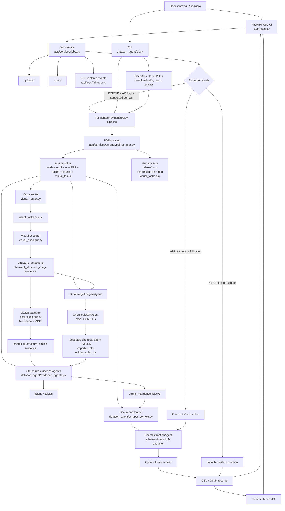
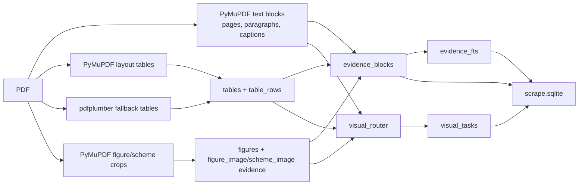
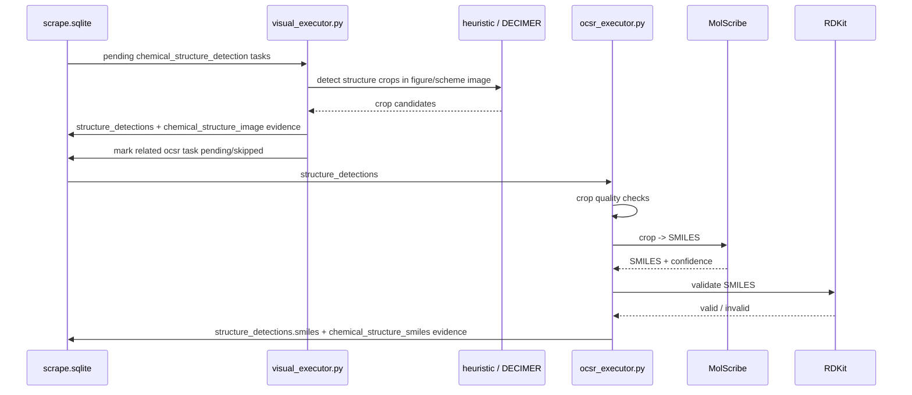
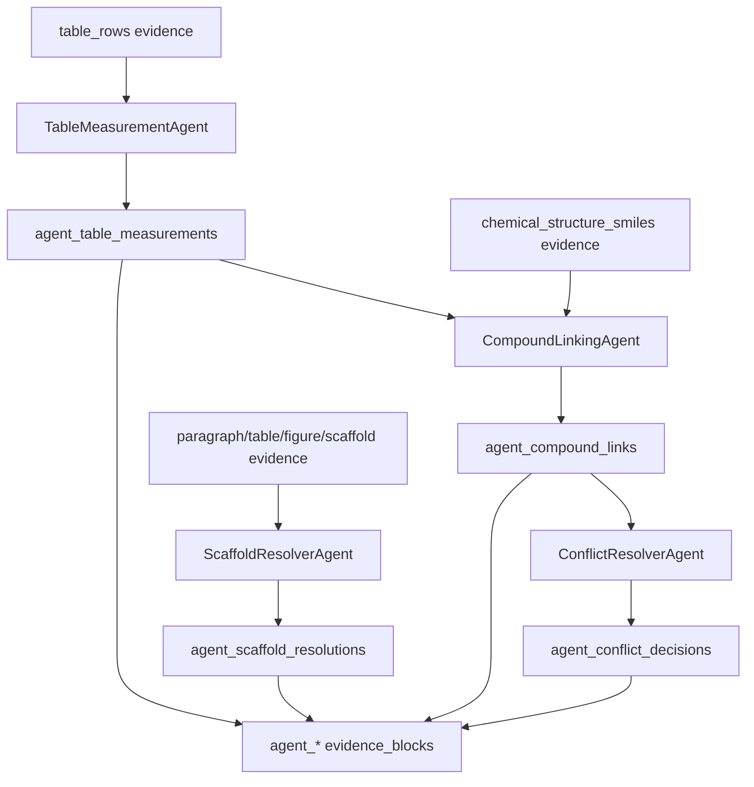
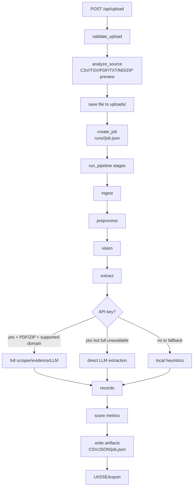

# Архитектура системы DataCon'26 ChemX

Документ для быстрой передачи контекста коллеге.

Сверено с последним коммитом:

```text
21bc475 4 agent table + com
```

Также учтены текущие файлы рабочего дерева, которые уже лежат в проекте:
FastAPI web UI, Docker/Caddy деплой и web-интеграция полного
scraper/evidence/LLM контура.

## 1. Что делает система

Система решает задачу ChemX extraction: из PDF-статей, ZIP-архивов с PDF,
табличных файлов или текста получить структурированные ChemX-compatible записи,
показать ход обработки в UI, сохранить артефакты и посчитать метрики.

Главная архитектурная идея: не просить LLM сразу "прочитать весь PDF и угадать
таблицу". Сначала строится проверяемый слой evidence:

- текст страниц, параграфы, заголовки и подписи;
- строки таблиц;
- вырезы фигур и схем;
- очередь визуальных задач;
- crop-кандидаты химических структур;
- SMILES из MolScribe или chemical OCR agents;
- structured evidence от агентов таблиц, связей, конфликтов и scaffold/R-group.

Финальный extractor получает уже обогащенный контекст с привязкой к страницам,
таблицам, crop'ам и source type.

## 2. Общая схема полной системы



## 3. Главные слои

| Слой | Файлы | Ответственность |
| --- | --- | --- |
| Web/API | `app/main.py`, `app/services/jobs.py` | Загрузка файлов, создание job, stages, SSE, экспорт CSV/JSON, metrics dashboard |
| Scraper/evidence | `app/services/scraper/*` | PDF -> SQLite evidence layer, таблицы, фигуры, visual task queue |
| Visual/OCSR | `visual_executor.py`, `ocsr_executor.py` | Поиск crop'ов химических структур, MolScribe, RDKit validation |
| Old chemical image agents | `app/services/agent/*` | Анализ схем/фигур, сопоставление compound_id -> crop, crop -> SMILES |
| Structured evidence agents | `datacon_agent/evidence_agents.py` | Measurement extraction из таблиц, связывание compound/SMILES/value, conflict/scaffold checks |
| Production extractor | `datacon_agent/agent.py`, `datacon_agent/cli.py` | Schema-driven LLM extraction по домену, windowing страниц, review pass |
| Metrics/evaluation | `datacon_agent/metrics.py`, `datacon_agent/normalize.py` | Нормализация и evaluator-compatible Macro-F1 |
| Deploy | `Dockerfile`, `docker-compose*.yml`, `Caddyfile` | Контейнер web-сервиса, volumes для `uploads/` и `runs/`, optional HTTPS |

## 4. Web-контур

Web-приложение работает на FastAPI.

Основные страницы:

- `/` - загрузка PDF/ZIP/CSV/TSV/TXT/MD;
- `/realtime` - live pipeline;
- `/metrics` - dashboard метрик;
- `/api/docs` - Swagger UI.

Основные API:

- `POST /api/upload` - загрузить файл и создать job;
- `POST /api/demo-job` - создать demo job;
- `GET /api/jobs/{job_id}` - состояние job;
- `GET /api/jobs/{job_id}/events` - SSE events;
- `POST /api/jobs/{job_id}/cancel` - отменить job;
- `GET /api/jobs/{job_id}/export.csv` и `.json` - экспорт результата.

Job проходит пять UI-stage:

```text
ingest -> preprocess -> vision -> extract -> score
```

Важно: эти stage нужны для UI и прогресса. Реальная тяжелая логика запускается
внутри stage `extract`.

### Web extraction modes

В `app/services/jobs.py` есть каскад:

1. **Full scraper/evidence/LLM pipeline**
   Запускается, если:
   - есть API key;
   - источник `pdf` или `zip`;
   - домен поддержан в `FULL_PIPELINE_DOMAIN_KEYS`;
   - файл сохранен в `uploads/`.

   Web-вариант полного контура сейчас делает:
   - PDF/ZIP -> PDF paths;
   - scraper в `runs/<job_id>/full_pipeline/scrapes`;
   - heuristic visual stage;
   - structured evidence agents из последнего коммита;
   - `ChemExtractionAgent.extract_document`;
   - optional review pass;
   - `domain_samples.json`;
   - web-friendly records.

2. **Direct LLM extraction**
   Если full pipeline не поддержан, упал или вернул пусто, но API key есть,
   web вызывает OpenAI-compatible router напрямую по извлеченному тексту/таблицам.

3. **Local heuristic extraction**
   Если LLM недоступен или ключа нет, система не падает, а возвращает локальную
   эвристическую экстракцию из CSV/TSV, selectable-text PDF, TXT/MD или ZIP
   summary.

API key не отдается наружу в `/api/jobs`, SSE и exports. В публичном
`model_config` остается только `api_key_configured`.

## 5. Scraper и evidence layer

Скрапер превращает PDF в локальную SQLite-базу `scrape.sqlite`.



Основные таблицы SQLite:

| Таблица | Смысл |
| --- | --- |
| `documents`, `files`, `pages` | Источник, файл, страницы и selectable text |
| `evidence_blocks` | Главная таблица для downstream/RAG/LLM контекста |
| `evidence_fts` | Full-text search индекс по evidence |
| `tables`, `table_rows` | Таблицы и строки таблиц |
| `figures` | Crop'ы рисунков и схем |
| `visual_tasks` | Очередь тяжелых OCR/OCSR/VLM задач |
| `structure_detections` | Crop-кандидаты структур и OCSR status |
| `ocr_blocks` | Зарезервировано под будущие OCR executors |
| `diagnostics` | Счетчики и notes по документу |
| `agent_*` | Таблицы structured evidence agents из последнего коммита |

Главный downstream source of truth - `evidence_blocks`. Файлы PNG/CSV нужны как
проверяемые артефакты и входы для визуальных стадий.

## 6. Visual routing, OCR и OCSR

`visual_router.py` не запускает тяжелые модели. Он только создает очередь задач:

| Task | Статус |
| --- | --- |
| `document_ocr` | Очередь есть, executor пока не реализован |
| `table_ocr` | Очередь есть, executor пока не реализован |
| `image_text_ocr` | Очередь есть, executor пока не реализован |
| `vlm_describe` | Очередь есть, executor пока не реализован |
| `chemical_structure_detection` | Executor реализован |
| `ocsr` | Executor реализован через MolScribe |

Исполняемый visual контур:



`heuristic` provider быстрый и локальный. `decimer` provider качественнее, но
требует отдельного ML-окружения. MolScribe и RDKit используются только на OCSR
стадии.

## 7. Chemical image agents

Это старый, но полезный контур для научных схем:

```text
scrape.sqlite
  -> DataImageAnalysisAgent
  -> ChemicalOCRAgent
  -> RDKit validation
  -> accepted SMILES imported into evidence_blocks
```

Разделение агентов:

| Агент | Что делает | Чего не делает |
| --- | --- | --- |
| `DataImageAnalysisAgent` | Понимает parent figure, crop labels, nearby evidence, связывает `compound_id -> crop_label` | Не генерирует SMILES |
| `ChemicalOCRAgent` | Анализирует один crop и выдает SMILES candidate + confidence + issues | Не принимает unresolved scaffold/R-group/cut crop как финальный SMILES |

После `ChemicalOCRAgent` результат проверяется через RDKit. Принятые записи
импортируются назад в `scrape.sqlite` как `chemical_structure_smiles` evidence.

## 8. Structured evidence agents из последнего коммита

Последний коммит добавил локальный structured fact layer:



Что делает каждый агент:

| Агент | Результат |
| --- | --- |
| `TableMeasurementAgent` | Достает из строк таблиц `compound_id`, target type, relation/value/units, bacteria, confidence |
| `CompoundLinkingAgent` | Связывает measurement candidates с `chemical_structure_smiles` по `compound_id` |
| `ConflictResolverAgent` | Группирует linked records и помечает accepted/needs_review при конфликтах |
| `ScaffoldResolverAgent` | Находит scaffold/R-group cases и помечает их как требующие substituent resolution |

Агенты пишут две формы результата:

- нормализованные таблицы `agent_table_measurements`,
  `agent_compound_links`, `agent_conflict_decisions`,
  `agent_scaffold_resolutions`;
- RAG-friendly строки обратно в `evidence_blocks` с source type
  `agent_table_measurement`, `agent_compound_link`,
  `agent_conflict_decision`, `agent_scaffold_resolution`.

## 9. Как evidence попадает в финальный extractor

`datacon_agent/scraper_context.py` превращает `scrape.sqlite` в
`DocumentContext`.

На каждую страницу собирается:

- исходный текст страницы;
- markdown-таблицы из `tables/table_rows`;
- selected evidence из `evidence_blocks`;
- agent evidence из `agent_*` source types;
- optional rendered page image.

В текст страницы добавляется блок `SCRAPER EVIDENCE`, поэтому
`ChemExtractionAgent` работает не только с raw PDF text, но и с enriched
контекстом.

Финальный extractor:

1. режет документ на окна по `pages_per_window`;
2. отправляет текст и, если включено, изображения страниц;
3. просит JSON строго по доменной схеме;
4. собирает candidates;
5. запускает optional review pass по article-level context;
6. нормализует строки под ChemX domain schema;
7. пишет CSV/JSON и считает метрики.

## 10. Отдельно: чистый pipeline

Ниже только порядок выполнения, без архитектурных деталей.

### 10.1 Web pipeline



Web full pipeline по PDF:

```text
uploaded PDF/ZIP
  -> extract PDF paths
  -> scrape_pdf_to_document
  -> pdf_scraper: pages, evidence, tables, figures, visual_tasks
  -> visual_executor(provider=heuristic)
  -> run_evidence_agents(all four agents)
  -> load_scraped_document: page text + tables + SCRAPER EVIDENCE
  -> ChemExtractionAgent.extract_document
  -> optional review pass
  -> domain_samples.json
  -> web records
  -> metrics and export
```

### 10.2 Maximum CLI pipeline

Этот путь нужен для воспроизводимого leaderboard/evaluator прогона и для
ручного включения тяжелых visual/chemical стадий.

```text
PDF
  -> scraper SQLite
  -> visual routing
  -> optional structure detection
  -> optional OCSR MolScribe + RDKit
  -> optional DataImageAnalysisAgent + ChemicalOCRAgent
  -> optional structured evidence agents
  -> DocumentContext
  -> schema-driven LLM extraction
  -> review pass
  -> normalized CSV
  -> evaluator Macro-F1
```

Пример команды для одного PDF:

```bash
python -m datacon_agent.cli extract \
  --domain benzimidazole \
  --pdf data/pdfs/article.pdf \
  --out outputs/article.csv \
  --use-scraper \
  --run-visual --visual-provider decimer \
  --run-ocsr --ocsr-device cpu --ocsr-min-confidence 0.5 \
  --run-chemical-agents \
  --run-evidence-agents \
  --model gpt-4.1 \
  --review-model gpt-4.1
```

Для batch:

```bash
python -m datacon_agent.cli batch \
  --domain nanozymes \
  --pdf-dir data/pdfs/nanozymes \
  --out outputs/nanozymes_candidates.csv \
  --use-scraper \
  --run-evidence-agents \
  --model gpt-4.1 \
  --review-model gpt-4.1
```

Review уже готового CSV:

```bash
python -m datacon_agent.cli review-csv \
  --domain nanozymes \
  --pred outputs/nanozymes_candidates.csv \
  --pdf-dir data/pdfs/nanozymes \
  --out outputs/nanozymes_reviewed.csv \
  --passes 2
```

Evaluation:

```bash
python -m datacon_agent.cli evaluate \
  --domain nanozymes \
  --pred outputs/nanozymes_reviewed.csv \
  --articles outputs/nanozymes_articles.txt \
  --out outputs/nanozymes_metrics.csv
```

### 10.3 Minimal scraper-only pipeline

```bash
python -m app.services.scraper pdf-dataset/antibiotics-12-01220-v2.pdf \
  --out runs/scrape-antibiotics \
  --doc-id antibiotics_1220
```

Артефакты:

```text
runs/scrape-antibiotics/scrape.sqlite
runs/scrape-antibiotics/tables/*.csv
runs/scrape-antibiotics/images/figures/*.png
runs/scrape-antibiotics/visual_tasks.csv
```

Structure detection:

```bash
python -m app.services.scraper.visual_executor \
  runs/scrape-antibiotics/scrape.sqlite \
  --provider heuristic
```

OCSR:

```bash
python -m app.services.scraper.ocsr_executor \
  runs/scrape-antibiotics/scrape.sqlite \
  --provider molscribe \
  --device cpu \
  --min-confidence 0.5
```

Chemical image agents:

```bash
python -m app.services.agent.multi_agent_pipeline \
  runs/scrape-antibiotics/scrape.sqlite \
  --out runs/scrape-antibiotics/chemical_agents \
  --data-model openai/gpt-4o-mini \
  --chemical-model openai/gpt-4o-mini \
  --no-response-format
```

## 11. Артефакты

| Артефакт | Где лежит | Что содержит |
| --- | --- | --- |
| `uploads/<file>` | Web upload | Исходный загруженный файл |
| `runs/<job_id>/job.json` | Web run | Состояние job, публичный model_config, logs, records |
| `runs/<job_id>/records.csv` | Web run | Экспорт записей |
| `runs/<job_id>/report.json` | Web run | Полный web report |
| `runs/<job_id>/full_pipeline/domain_samples.json` | Web full pipeline | Raw domain samples от `ChemExtractionAgent` |
| `scrape.sqlite` | Scraper run | Центральная evidence DB |
| `tables/*.csv` | Scraper run | Извлеченные таблицы |
| `images/figures/*.png` | Scraper run | Parent figures/schemes |
| `images/structures/**/structure_*.png` | Visual executor | Crop-кандидаты структур |
| `chemical_ocr_results.json/csv` | Chemical agents run | Crop -> SMILES результаты |
| `multi_agent_summary.json` | Chemical agents run | Сводка двух image agents |
| `outputs/*.csv` | CLI production | Финальные ChemX predictions |
| `outputs/*metrics*.csv` | CLI evaluation | Evaluator metrics |

## 12. Деплой

Docker web-образ собирает приложение, `app`, `datacon_agent`, `docs` и
requirements.

Локально:

```bash
docker compose build
docker compose up -d
curl http://127.0.0.1:8000/api/health
```

Volumes:

```text
./uploads -> /app/uploads
./runs    -> /app/runs
```

Для HTTPS поверх `datacon-web` есть `docker-compose.prod.yml` с Caddy:

```bash
docker compose -f docker-compose.yml -f docker-compose.prod.yml up -d --build
```

`SITE_ADDRESS` задает домен или `:80`.

## 13. Что сейчас важно помнить

- Обычный OCR страниц/таблиц пока только ставится в `visual_tasks`; executors
  для `document_ocr`, `table_ocr`, `image_text_ocr`, `vlm_describe` еще не
  реализованы.
- Web full pipeline сейчас запускает heuristic visual stage и structured
  evidence agents. OCSR/MolScribe и chemical image agents доступны через CLI
  flags, но не включены в web default path.
- `EyeDrops` входит в `FULL_PIPELINE_DOMAIN_KEYS`, но локальная выборка PDF
  для него зависит от доступности PMID/DOI источников.
- DECIMER и MolScribe требуют optional visual dependencies и часто отдельного
  окружения.
- RDKit валидирует синтаксис и canonical SMILES, но не доказывает, что модель
  идеально прочитала картинку.
- Scaffold/R-group cases пока помечаются как `needs_review`; автоматической
  сборки substituent combinations еще нет.
- Основной источник для финального extractor - `evidence_blocks`, а не папка с
  изображениями.

## 14. Быстрая карта файлов

| Файл | Зачем смотреть |
| --- | --- |
| `app/main.py` | FastAPI routes, OpenAPI, upload/demo/jobs/metrics endpoints |
| `app/services/jobs.py` | Web job lifecycle, extraction mode fallback cascade, full web pipeline |
| `app/services/scraper/pdf_scraper.py` | PDF -> SQLite evidence |
| `app/services/scraper/storage.py` | SQLite schema |
| `app/services/scraper/visual_router.py` | OCR/OCSR/VLM task routing |
| `app/services/scraper/visual_executor.py` | Structure detection executor |
| `app/services/scraper/ocsr_executor.py` | MolScribe OCSR + RDKit validation |
| `app/services/agent/multi_agent_pipeline.py` | DataImageAnalysisAgent -> ChemicalOCRAgent |
| `datacon_agent/evidence_agents.py` | Table/link/conflict/scaffold agents from latest commit |
| `datacon_agent/scraper_context.py` | SQLite evidence -> DocumentContext |
| `datacon_agent/agent.py` | Schema-driven LLM extraction and review |
| `datacon_agent/cli.py` | CLI commands and pipeline flags |
| `Dockerfile`, `docker-compose.yml`, `Caddyfile` | Runtime/deploy path |
